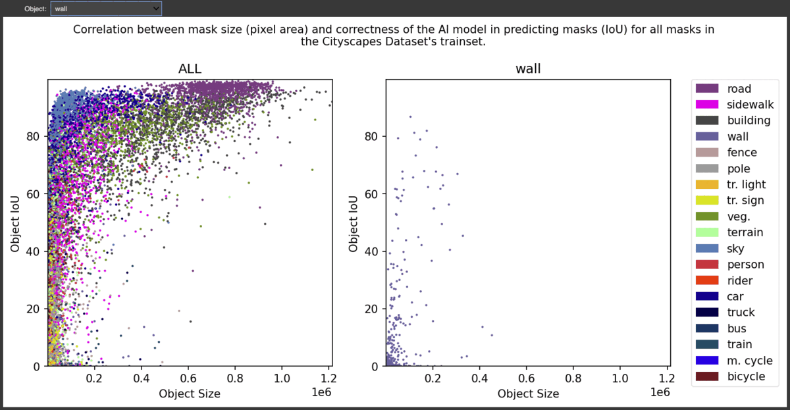
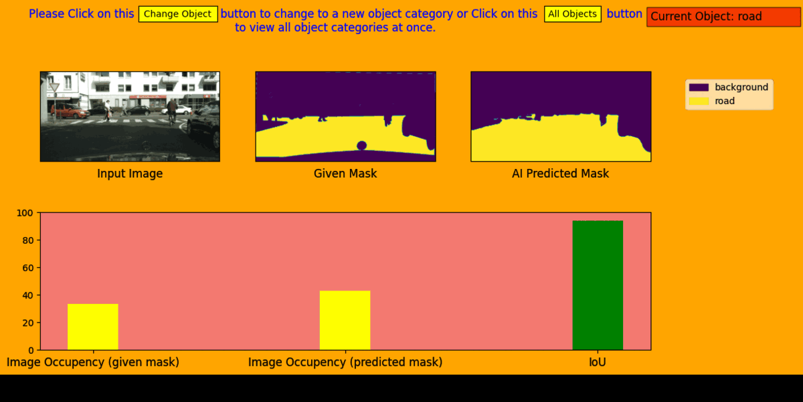
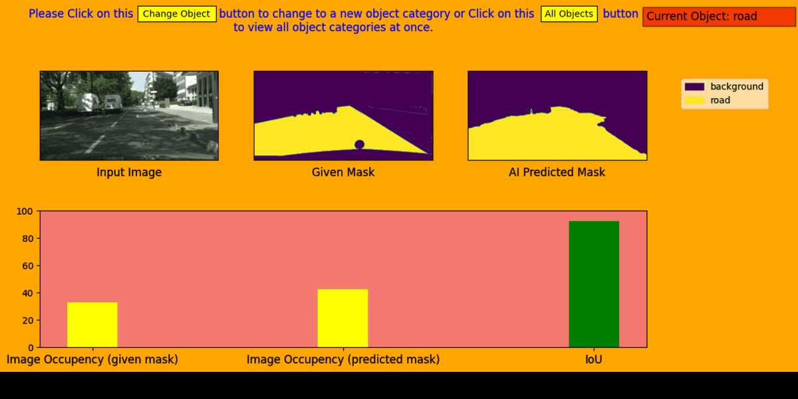

# VisionAI

## 👨🏻‍💻 Domain
- [x] Computer Vision
- [x] Machine Learning

## Overview

VisionAI is a deep learning-based computer vision project focused on semantic segmentation and object detection for autonomous driving and smart city applications. It utilizes the Cityscapes dataset to train AI models that can identify and segment objects such as persons, cars, roads, traffic signs, and more. The goal is to enhance AI-driven perception systems used in self-driving cars and intelligent traffic monitoring.

## Features

- **Semantic Segmentation**: Classifies each pixel in an image into meaningful categories like roads, vehicles, pedestrians, and signs.
- **Object Detection**: Identifies and localizes objects in urban street scenes, aiding in autonomous driving systems.
- **Deep Learning Models**: Implements PyTorch and Matplotlib to develop models for accurate object recognition and segmentation.

## What is IoU?
Intersection over Union (IoU) is a key metric used to evaluate the accuracy of object detection and segmentation models. It measures the overlap between the predicted and ground truth bounding boxes or segmented areas.
A higher IoU score indicates better model performance in accurately detecting objects.

## Examples

### 1. Discovering Correlation Between Object Size and Object IoU for Different Category Classes

### 2. Comparing given object mask to predicted mask using AI

### 3: Discovering Correlation Between Object Size and Object IoU for Different Category Classes
https://github.com/user-attachments/assets/8c6c0565-dcff-4a93-9b3f-10fb0856d2e2

## Datasets

The dataset that will be used is called the Cityscapes dataset, which contains 5000 images and high quality ground truth label. The images are seperated into 2975 training images, 500 validation images, and 1525 test images.

The required data can be downloaded from https://www.cityscapes-dataset.com/downloads
